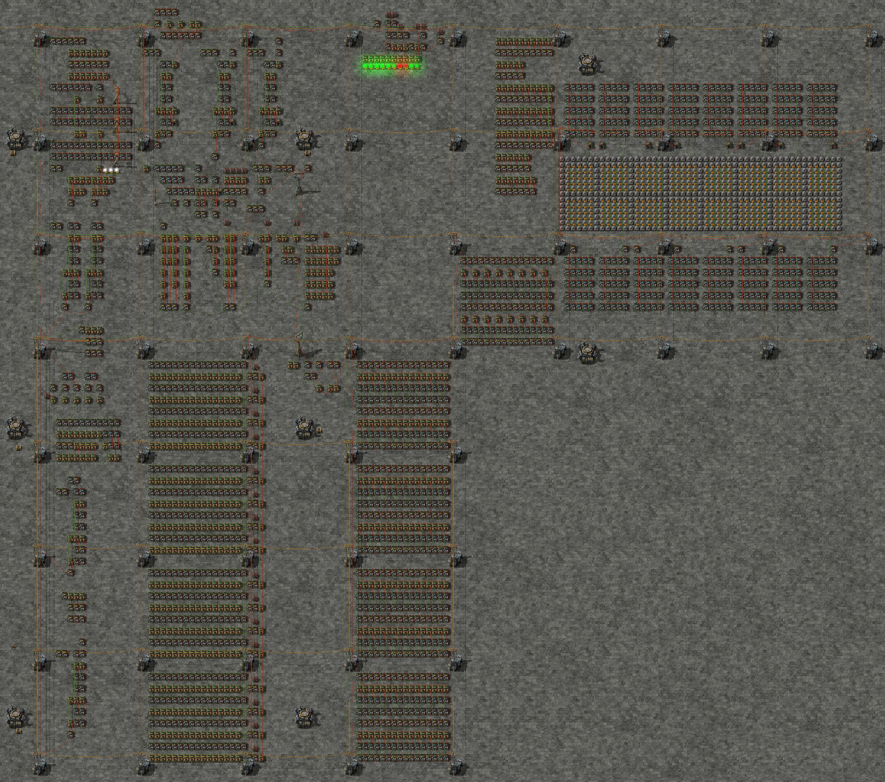

# Factorio Processor / Assembly Compiler


This is a repository for a processor I built in Factorio. It is a 3.75 Hz*, 16-Bit RISC Style Processor with 512 Byte ROM, 128 Byte RAM, and a 16-Bit ASCII Character Display. Map download, compiler, example programs and supporting documentation can all be found here.

\* I have gotten it to run at up to 120 Hz with `/c game.speed=32`, which is 1920 UPS. Any more and I'm scared for the health of my PC.



---
##### World Download

A world download containing the full processor, including various blueprints used in construction, and example programs can be found [here](world/Processor%20V2%20Final.zip).

---
##### Demonstration Video

You can see a working demonstration of the processor [here](processor_demo.mp4). The processor is running the program found under `/src/test/resources/test_input_output.s`, at 32x normal game speed.

---
##### Assembly Compiler

In order to use the compiler, you need to know how to run java via command line:
```
java -jar factoriocompiler.jar [program arguments]
```

The compiler can take a few different arguments, which in no particular order are:

 - `-f` or `--file`: This specifies the input assembly source code. Following this must be a file path.
 - `-l` or `--line`: This specifies a single line of assembly source code as input. Following this must be a valid line of Factorio assembly code. Note this and `-f` are mutually exclusive.
 - `-b` or `--blueprint`: Toggles the blueprint flag, which will turn the resultant assembly into a Factorio ROM Blueprint, ready to be shift-clicked onto the processor. This is by far the easiest and least error-prone way to load programs into the processor.
 - `-d` or `--debug`: Toggles the debug flag, which outputs a bunch more data about the assembly, the bit patterns, the instructions etc.
 
Example Usage:
```
java -jar factoriocompiler.jar -d --file path/to/assembly_code.s --blueprint
```

The Assembly syntax is very similar to the style of the [Nios-II DE0](https://www.intel.com/content/dam/www/programmable/us/en/pdfs/literature/hb/nios2/n2cpu_nii51017.pdf) assembly. Each instruction is a single line, with a keyword identifying the instruction, followed by comma separated arguments. Arguments can be registers (`r0`, `r1`, `r2`... `r7`, `ra`, `sp`), labels (`br loop`), or immediate values (signed decimal, hex, octal, or binary digits)

There are also a few additional assembler macros:

 - `[LABEL:] .asciz Some Text`: This will compile "Some Text" to ASCII codes and insert them into ROM directly following the program data. The addition of the label will allow you to refer to the string pointer via the name of the label
  - `.malloc LABEL, amount`: This will "allocate" a certain amount of memory to the processor, and assign the label to the start of that section of memory. Note there are no checks on memory allocation except for allocating more than the processor has to start with. Programs will have to manage their own memory, as such this is more of a macro used to get a label for a memory location. 

---
##### Documentation / Processor Specifications

The full processor specifications can be found [here](PROCESSOR.md). This includes documentation on the instruction set (if you want to write example programs), the inner signals of the processor, and also descriptions of my methodology, the design elements including RTN descriptions of the various instructions, and outlines of the components involved.

In some places this processor is referred to as "V2". The original design and implementation of this processor failed to work out due to a badly designed instruction set, lack or organization and a general failure to do much of anything at all. This is the second iteration on this design and concept.
 
